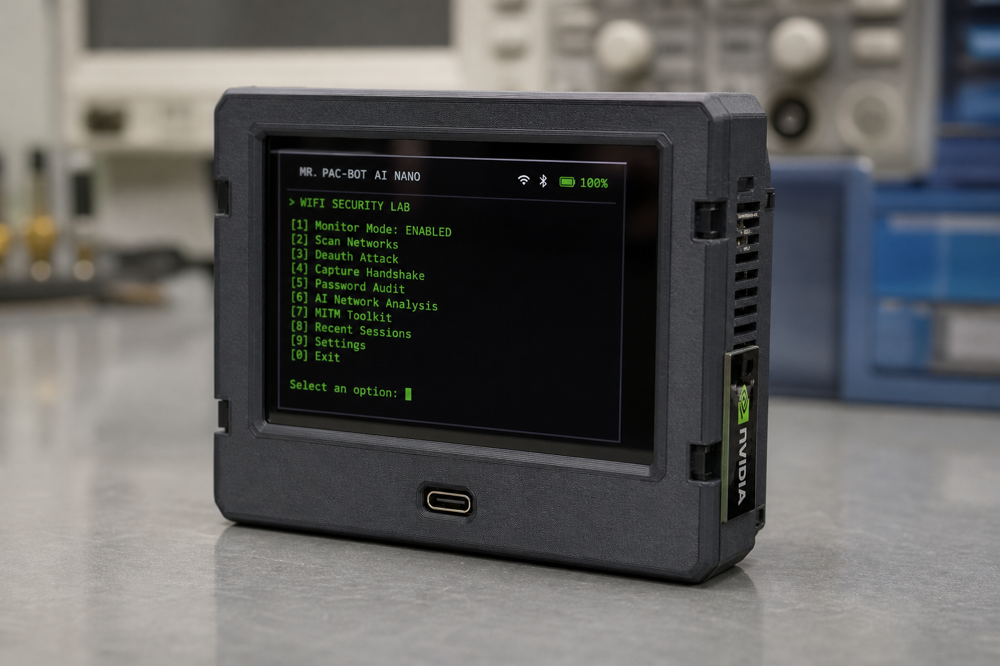

<p align="center">
  
  <br/><sub><strong>Mr. Pac-Bot</strong> — CYD 2.8″ + Jetson Nano 4GB pocket shell. STLs → <a href="hardware/README.md">hardware/</a></sub>
</p>

# Mr. CrackBot AI Nano

**Status:** Early development — lab/simulation mode works on Windows and Linux CI; Jetson hardware path requires monitor-mode Wi‑Fi tools.

**Hacker Planet LLC** · Philadelphia, PA — co-founded by **Andy Klwal** and **Pat**. Mr. CrackBot AI Nano is a Jetson Nano–oriented project for **authorized** Wi‑Fi security research: handshake capture, wordlist generation, and GPU hashcat cracking. Use only on networks you own or have written permission to test.

Part of the **Hacker Planet** toolkit → [CyberThreatGotchi ecosystem](https://github.com/salvador-Data/cyberThreatGotchi/blob/main/docs/ECOSYSTEM.md).


| Project | Role |
|---------|------|
| [CyberThreatGotchi](https://github.com/salvador-Data/cyberThreatGotchi) | Defensive edge sensor + audit logs |
| [Bjorn](https://github.com/salvador-Data/Bjorn) | Pi assessment |
| **Mr.-CrackBot-AI-Nano** (this repo) | Authorized lab wordlists |
| [M5_OS-Cardputer](https://github.com/salvador-Data/M5_OS-Cardputer) | Portable UI |

CrackBot stays in the **lab VLAN**. CTG monitors the **production/homelab edge** — complementary, not interchangeable.

## Features (target)

- Heuristic + optional AI wordlist generation (`MR_CRACKBOT_USE_AI=1` + `requirements-jetson.txt`)
- WPA handshake capture workflow (airodump-ng / aireplay-ng on Linux)
- Hashcat integration for GPU cracking on Jetson
- Pygame intro + Tk control UI

## Quick start (simulation — no Wi‑Fi hardware)

```bash
git clone https://github.com/salvador-Data/Mr.-CrackBot-AI-Nano.git
cd Mr.-CrackBot-AI-Nano
python -m venv .venv
source .venv/bin/activate   # Windows: .venv\Scripts\activate
pip install -r requirements.txt
pytest tests/ -v
python main.py --simulation --skip-intro --headless
```

## Jetson / GPU (optional AI)

```bash
pip install -r requirements-jetson.txt
export MR_CRACKBOT_USE_AI=1
python main.py --skip-intro
```

## Hardware

Bill of materials: Jetson Nano 4GB, USB Wi‑Fi adapter (monitor mode), CYD 2.8" touchscreen (UI shell only), and battery pack.

**Shop:** Bench lab assembled **$449** (`crackbotBench`) — not a CYD-only product. CYD field builds from **$79.99** are separate SKUs. See [docs/PRICING.md](docs/PRICING.md).

**3D print files:** `hardware/stl/pocket/` (front, rear, clip). Regenerate with `python hardware/generate_stl.py`. COD clip + wall dock: `hardware/stl/accessories/` (`--variant all`). See [hardware/README.md](hardware/README.md).

## Wordlists

`setup.py` can download and merge RockYou2024 archives (Mega links in script). This is **optional** and requires `megatools` + `p7zip-full` on Linux:

```bash
python setup.py
```

## Legal

Educational and authorized testing only. The authors are not responsible for misuse.

## Contributing

Open an issue or PR on [GitHub](https://github.com/salvador-Data/Mr.-CrackBot-AI-Nano).
