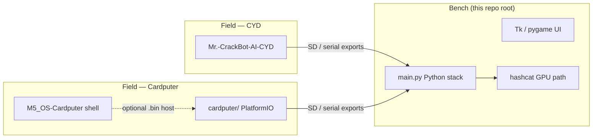

# Architecture — Mr. CrackBot AI Nano

## System context

Mr. CrackBot AI Nano is the **bench + portable field** stack in the Hacker Planet ecosystem. It spans three runtimes that share lab semantics but ship as distinct SKUs:

| Component | Location | Hardware |
|-----------|----------|----------|
| Jetson bench automation | Repo root (`main.py`, `ai/`, `tests/`) | Jetson Nano 4GB + USB monitor-mode Wi‑Fi |
| CYD touch firmware | [Mr.-CrackBot-AI-CYD](https://github.com/salvador-Data/Mr.-CrackBot-AI-CYD) | ESP32-2432S028 |
| Cardputer keyboard firmware | `cardputer/` | M5Stack Cardputer (ESP32-S3) |
| 3D enclosure | `hardware/stl/` | CYD window + Jetson pocket shell |

## Python bench stack

| Module | Role |
|--------|------|
| `main.py` | Entry point — simulation, intro, headless CI |
| `ai/password_model.py` | Heuristic + optional AI wordlists (`MR_CRACKBOT_USE_AI=1`) |
| `setup.py` | Optional RockYou2024 merge (Mega links; Linux tools) |
| `tests/` | Simulation-mode pytest (no Wi‑Fi hardware required) |

Environment flags:

| Variable | Effect |
|----------|--------|
| `MR_CRACKBOT_SIMULATION=1` | Skip hardware Wi‑Fi tools |
| `MR_CRACKBOT_SKIP_INTRO=1` | Skip pygame intro |
| `MR_CRACKBOT_USE_AI=1` | Enable AI wordlist path (requires `requirements-jetson.txt`) |

## Cardputer firmware (`cardputer/`)

Keyboard-first UI with **feature parity** to CYD where ESP32-S3 hardware allows. Built with PlatformIO env `m5stack-crackbot`.

| File | Role |
|------|------|
| `cardputer/src/main.cpp` | Menu loop, M5Cardputer keyboard routing |
| `cardputer/platformio.ini` | ESP32-S3 build flags + M5Cardputer lib |

Release workflow attaches `firmware.bin` to GitHub releases on version tags.

## Hardware enclosure

Parametric STLs generated by `hardware/generate_stl.py`:

- `hardware/stl/pocket/` — Mr. Pac-Bot front/rear/clip
- `hardware/stl/accessories/` — COD clip + wall dock

See [hardware/README.md](../hardware/README.md).

## Ecosystem links

- [CyberThreatGotchi](https://github.com/salvador-Data/cyberThreatGotchi) — edge defense (complementary VLAN)
- [M5_OS-Cardputer](https://github.com/salvador-Data/M5_OS-Cardputer) — Cardputer OS + app catalog
- [Product docs](https://salvador-Data.github.io/cyberThreatGotchi/crackbot.html)
